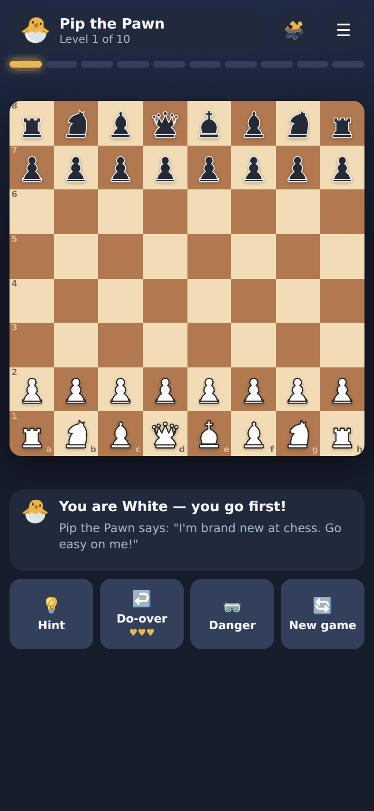
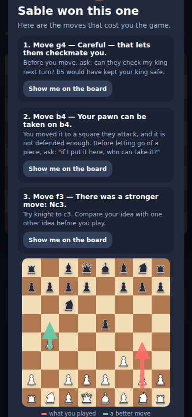
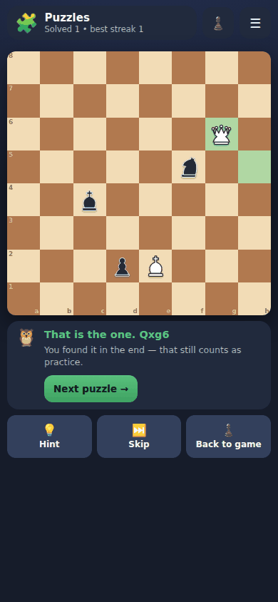

# Wildcat Chess

A single-file chess game built to teach a 7-9 year old, themed for the Woodland Springs Wildcats. Ten difficulty levels, a coach that names every mistake in plain language, and spaced-repetition puzzles built from the player's own blunders.

No CDN, no framework, no network calls. One HTML file that runs offline on any device.



---

## Quick start

```bash
npm install          # playwright, terser, clean-css (dev only — the game itself has no deps)
npm run build        # -> dist/chess-quest.html (readable) and dist/index.html (deploy this)
npm test             # perft + contrast + engine/coach/puzzle checks + 89 browser checks
```

To play locally: `npm run serve`, then open <http://localhost:8080>.

To deploy: put **`dist/index.html`** on any static host. It must be named `index.html` to be served at the site root.

To install on an iPhone or iPad: open the deployed URL in **Safari** (Chrome cannot do this), then **Share → Add to Home Screen**. It gets an app icon and opens full screen. iOS will not run the file properly from the Files app — it has to be served over http(s).

---

## What it does

**Play.** Ten opponents, a walk through the woods that ends at the school mascot: Pip the Chipmunk (random mover), Nutmeg the Rabbit, Bramble the Hedgehog, Dozer the Beaver, Bandit the Raccoon, Ember the Fox, Digger the Badger, Shadow the Coyote, Talon the Hawk, and finally The Wildcat, Chess Master. Win and you climb a level. Losing never demotes you.

**Coach.** On every move the player makes:

- If she is about to hang a piece, the game pauses **before** the bot punishes it and offers a do-over — three per game. A blunder becomes a lesson instead of a loss.
- After a loss, it replays her three worst moves with a red arrow for what she played and a green one for what was better, plus one habit to practise.
- Optional "danger goggles" ring every piece of hers that can be taken for free.
- It warns her when a position has repeated twice, so she does not shuffle a won game into a draw.

**Puzzles.** 34 machine-verified tactics puzzles plus every clear-cut blunder from her own games, on a Leitner spaced-repetition schedule. First-try solves move a puzzle up a box; misses bring it back next session.

| | |
|---|---|
|  |  |

---

## Layout

```
src/
  engine.js       0x88 board, legal moves, castling, en passant, promotion,
                  check/mate/stalemate, 50-move, repetition, FEN, SAN
  ai.js           evaluation, alpha-beta search, static exchange evaluation,
                  the ten bot definitions
  coach.js        turns engine numbers into sentences a child can act on
  theme.js        every colour in the project, as CSS custom properties
  pieces.js       original SVG piece artwork (45x45 grid)
  puzzles.js      GENERATED — machine-verified puzzle set, do not hand-edit
  ui.js           board, input, progression, puzzle mode, overlays, sound
  shell.html      markup, styles, and the slots the build fills in

tools/
  build.py            concatenates src/ into dist/chess-quest.html + build/combined.js
  minify.js           dist/chess-quest.html -> dist/index.html
  generate-puzzles.js regenerates src/puzzles.js (verified, not hand-written)
  preview-pieces.js   renders the piece set to docs/screenshots for eyeballing

tests/
  perft.js             move generation vs published node counts
  engine.test.js       engine, AI, coach and puzzle-set checks
  browser.test.js      89 end-to-end checks in real Chromium, six device sizes
  contrast.test.js     every theme must stay as readable as the classic board
  repetition.test.js   a winning side must not shuffle into a draw

dist/     the built game — index.html is what you deploy
docs/     BUILD-NOTES.md (the full design write-up) and screenshots
build/    generated test bundle, gitignored
```

`src/` is split so every layer except the UI is pure logic and testable in Node without a browser. `build.py` concatenates them; there is no module system at runtime, which is what keeps the output a single file with no loader.

---

## Scripts

| Command | What it does | Time |
|---|---|---|
| `npm run build` | Build both dist files | instant |
| `npm test` | Build, perft, quick engine tests, all browser tests | ~5 min |
| `npm run test:perft` | Move generation proof only | ~3 s |
| `npm run test:quick` | Engine, coach and puzzles, skipping self-play | ~60 s |
| `npm run test:engine` | Adds self-play and ladder strength ordering | ~10 min |
| `npm run test:browser` | 106 checks against `dist/index.html` (Chromium) | ~4 min |
| `npm run test:browser:readable` | Same checks against the unminified build | ~4 min |
| `npm run test:browser:webkit` | The same 106 checks on WebKit | ~4 min |
| `npm run test:safari` | WebKit: storage, audio, workers, font independence | ~5 min |
| `npm run test:contrast` | Palette legibility guard for every theme | instant |
| `npm run test:repetition` | Repetition-draw regression | ~2 min |
| `npm run test:all` | Everything | ~20 min |
| `npm run puzzles` | Regenerate and re-verify the puzzle set | ~6 min |
| `npm run pieces` | Render the piece artwork to look at it | ~2 s |

**Never hand-edit `dist/`.** Edit `src/` and rebuild, or your next build silently discards the change.

---

## Testing on Safari

The game is played on an iPad, so Chromium alone is not enough — that gap is
what let the pawn bug ship (BUILD-NOTES §14). Every browser suite takes an
`ENGINE` variable:

```bash
npx playwright install webkit     # once
npm run test:browser:webkit       # the interface suite, on WebKit
npm run test:safari               # storage, audio, workers, fonts
```

The suites serve `dist/` over http rather than opening `file://`. That is not
cosmetic: WebKit treats a `file://` document as an opaque origin and refuses
`localStorage` there, so a `file://` run would silently exercise the in-memory
fallback and report that persistence works.

CI runs both suites on Chromium and WebKit for every push.

**What this still does not prove.** WebKit-on-Linux shares an engine core with
Safari but not iOS's font stack, audio session policy, or storage eviction
(ITP). It catches far more than Chromium does; it is not a substitute for
opening the deployed URL on the actual iPad once per release.

---

## Tuning it

**Opponent names, icons and taunts** - the `BOTS` array in `src/ai.js`. Safe to edit freely; the browser suite checks the ladder has ten distinct named opponents ending in the Wildcat.

**Difficulty** — also the `BOTS` array in `src/ai.js`, but `depth`, `q`, `rand`, `gentle`, `resignAt`, `top` and `time` are the measured dials. `gentle` is the fraction of turns a bot declines to capture at all, which is what makes the bottom of the ladder easier than random. `resignAt` is the material deficit at which it concedes, so a learner who wins the material gets the win before she can force mate. See BUILD-NOTES section 16. Changing those invalidates the strength self-play, so re-run `npm run test:engine` if you touch them. Three independent dials per level: search `depth`, `q` (quiescence — the single biggest strength jump), and `rand`, the fraction of turns the bot throws away a random legal move. That last one is what makes levels 1–5 winnable by a beginner: the bot has real ideas but forgets to use them.

**Coach sensitivity** — `COACH_LEVELS` in `src/coach.js`. `loss ≥ 300` interrupts play; `≥ 140` is mentioned; `≥ 70` is logged for the report only.

**Which mistakes become puzzles** — `PZ_MIN_CLARITY` in `src/ui.js`. A blunder is only saved as a puzzle if the best move beats the runner-up by that margin, so she is never asked to guess between two moves the engine rates alike.

**Colours** - `src/theme.js`, the only file with themed hex values. Two themes ship: Wildcats (default, Woodland Springs green/white/purple) and Classic. Switch in Settings. Run `npm run test:contrast` after any change; it fails if a palette drops below the classic board's readability.

**Piece artwork** — `src/pieces.js`, then `npm run pieces` to look at it. Pieces are SVG rather than Unicode characters on purpose; see BUILD-NOTES §14 for the bug that caused.

---

## How verification works here

The interesting decisions in this project are mostly about testing, because chess is unusually easy to be confidently wrong about.

- **Move generation is proven, not spot-checked.** `perft.js` counts leaf nodes from seven standard positions to depth 5 and compares against published totals — 4,865,609 from the opening position. One wrong castling or en-passant edge case and the count diverges. Currently 30/30 exact.
- **The puzzle set is generated and double-verified,** never hand-authored. Every puzzle must survive a depth-5 check that its answer beats the runner-up by 250+, then an independent depth-6 re-check. Of my first six test failures on this project, five were hand-written chess positions of mine that were simply wrong — so hand-authoring 34 of them was not an option.
- **Ladder strength is measured, not assumed.** Self-play with alternating colours: L3 beat L1 6–0, L6 beat L3 6–0, L8 beat L5 4–0.
- **Browser tests run against the file that ships,** including playing a full game to checkmate, deliberately losing one to exercise the coach report, and the whole puzzle flow.

The limit worth knowing: these tests prove the code works *in the test environment*. They passed 76/76 while shipping a bug that turned White's pawns black on iOS, because the cause was a font-stack behaviour that Linux Chromium does not reproduce. BUILD-NOTES §14 has the full post-mortem — it is the most useful thing in this repo.

---

## Documentation

[`docs/BUILD-NOTES.md`](docs/BUILD-NOTES.md) — the full write-up: why each design decision was made, how the coaching layer turns engine scores into lessons, how the puzzle generator verifies itself, the iOS work, and the two post-mortems.

---

## License

MIT. The piece artwork in `src/pieces.js` is original work, not derived from any existing chess set.
